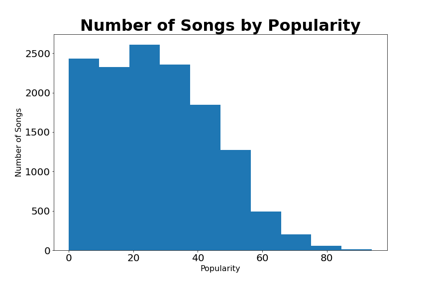
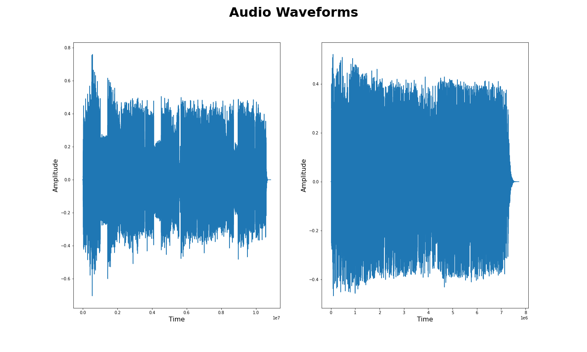
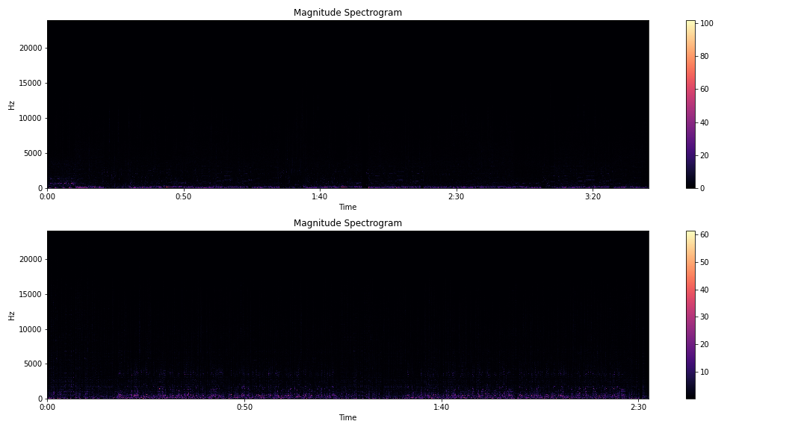
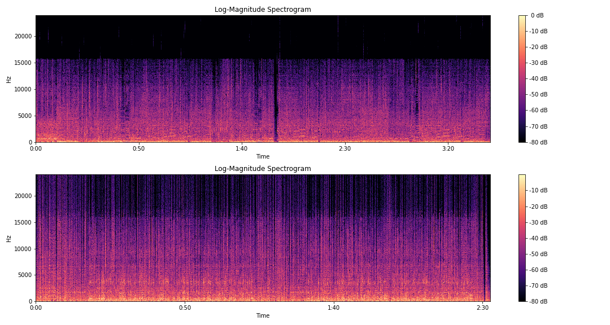

# Yet Another Spotify Recommender (YASR)

## Table of Contents

- [Where to Start](#Where-to-Start)
- [Problem Statement](#Problem-Statement)
- [Data Collection](#Data-Collection)
- [EDA](#EDA)
- [Audio File Modeling](#Audio-File-Modeling)
- [Spotify Features Modeling](#Spotify-Features-Modeling)
- [Deployment](#Deployment)
- [Performance](#Performance)
- [Conclucsion](#Conclusion)
- [Further Steps](#Further-Steps)
- [Thank You](#Thank-You)

### Where to Start

This project uses libraries that have a lot of dependencies so it is recommended to setup a Python virtual environment to make sure nothing goes wrong. Below I will be outlining the steps required on Ubuntu 20.04 to run everything smoothly. It is also important to note that if you are planning to run this locally, you will want a powerful graphics card as a lot of the code requires immense computing power. I ran all of this on my machine with an NVIDIA RTX 3090. 

First off you will want to install Python 3.8 and Python 3.8 venv:

```
sudo apt-get install python3.8 python3.8-venv python3-venv
```

Now to setup your virtual environment and get it working in jupyter do the following:
```
python3.8 -m venv /path/to/venv
source /path/to/venv
pip install --user ipykernel
python -m ipykernel install --user --name=nameofvenv
```

Now go to the code folder and install all the packages for the project by running this:
```
pip install -r requirements.txt
```

You will also need to install NVIDIA drivers to run all the GPU dependent code. First off you will want to install the base NVIDIA driver, to do this do the following in the command line:
``` 
ubuntu-drivers devices
```

This will show the driver you will need to install, it will be something like nvidia-driver-4xx. Note that nvidia-driver-450 or higher is needed for tensorflow. To install the driver run the following in the command line, replace the Xs with the driver recommended to you by the previous command:
```
sudo apt install nvidia-driver-4xx
```

Now you will want to reboot your system. 

After your system has come back up you will need to install the CUDA Toolkit and cuDNN. Links for the following tools are below, I will not go over how to install these as the instructions using the following links are pretty clear. You will want to get CUDA 11.0 as it is currently the newest stable version supported by Tensorflow. 

[CUDA Toolkit](https://developer.nvidia.com/cuda-toolkit-archive)

[cuDNN](https://developer.nvidia.com/rdp/cudnn-archive)

Now you will be able to run through the notebooks without any issues. It is recommended you go through the notebooks in the code folder in sequential order to understand the entire process. The app folder contains the code required to deploy the project to the web using Flask. 

### Problem Statement

One of the biggest issues that users have on Spotify is finding new music to listen to. Reasons for this range from the fact that Spotify consistently only recommends songs from well known artists to Spotify having a massive library that is very difficult to search through. This makes Spotify a very difficult platform for new artists to succeed as they are consistently being overshadowed by the top artists in the world. In order to solve this problem, we will try to build a recommender that only recommends songs from new artists that people likely have not heard of. 

### Data Collection

I gathered data from 3 main sources for this project: Spotify, Everynoise, and Youtube Music. To start off, I pulled new releases for the week from Everynoise. Everynoise is a great site that also tracks different genres of music on Spotify. Next, I used the SpotDL library to download the audio files for the new releases and songs I personally listened to from Youtube Music as the Spotify API does not allow downloading of tracks directly from Spotify. I also got the audio features and popularity of artists for all tracks using the Spotify API. 

## EDA

The EDA part of this project was not very involved as I only needed to see what the distribution of the popularity of artists on Spotify was and take a quick look at what audio features Spotify's API includes. Below is a histogram showing this distribution. 



Looking at Spotify's audio features we see 11 features that include danceability, energy, key, loudness, mode, speechiness, acousticness, instrumentalness, liveness, valence, tempo, duration , and time signature. We see that mode and key are categorical features, while the rest are all numerical features. 

### Audio File Modeling

The first approach I took was to compare the audio files of all the new releases to the tracks the user has listened to. The first step in this process was to look at the raw audio signals of each song to see if we could see anything obvious that was different. Below is a comparison of the raw audio signal of 2 tracks. 



Here we see that we can not really see anything different from the 2 signals. One important thing we can see in these signals is the silence that is common at the beginning and end of songs. As we have no interest in comparing signals with no sound we trim the beginning and ends of songs where the amplitude of the signal is small. Below you can see the signals as a result of this. 


As these raw audio signals are not useful, I moved on to using Fourier transforms to change these signals from the time domain to the frequency domain. Specifically, I used the Short-Time Fourier Transform (STFT) to covert signals to the frequency domain while keeping some of the time component using windowing. This helps us see where frequencies change quickly in a song such as when there is a bass drop. Below is an image of our audio signals tranformed using STFT.



Here we can't really tell much as most of our signal lies below 5000 Hz. To solve this issue we log-scale our signals to make our features much more pronounced. 



Now that we have a signal that is much more workable we change it into Mel Frequency Ceptrum Coefficients (MFCC) to split our signal into bins to optimize our training times by reducing the dimensionality of our data. Below is the two audio signals converted to MFCC. 


After converting the audio files to a form that can be worked with, I took the cosine similarities between each of the audio signals. The main issue with using the cosine similarity however is that audio signals must be trimmed further as the cosine similarity can only be taken between two signals with the same length. Due to this additional step required it took 2 hours just to calulate all the cosine similarites of 1 song to all the new releases. 

To solve the issues of the cosine similarity, I moved on to using Dynamic Time Warping (DTW). This allowed for comparisons between different size audio signals and reduced the time needed to compare a user's song to new releases down to 1 hour. Of course users probably don't want to wait around for 50 hours to get a new recommendation for music, so I had to figure out a different way to compare songs. 

### Spotify Features Modeling

As comparing audio files was too slow, I decided to change over to using Spotify API's audio features. The features I decided to use were danceability, energy, loudness, speechiness, acousticness, instrumentalness, liveness, valence, tempo, and mode. By only using these features, I was able to reduce training time down to 2 seconds as only a small set of features of each track needed to be compared rather than large matrices comparing the frequencies of each song. I then took the 5 most similar songs and the 5 most unsimilar songs to use as recommendations to the user. 

### Deployment

After finding a performant way to compare user's tracks and new releases I moved on the deployment. To to this, I wrote a custom web app in Flask with a Redis queue to ensure that my system does not get overloaded in the case that many users want to use the app at the same time, such as during my presentation of the project. In order to make the app public, I used NGINX reverse proxy in order to protect my IP address. Gunicorn was used as using the default Flask server is a bad idea for production deployment. Below I will show the steps needed to setup a Redis queue, Gunicorn, and NGINX. 

To setup Redis run the following in the command line below:

```
sudo apt-get install tk8.5 tcl8.5
mkdir redis_setup && cd redis_setup
curl -O http://download.redis.io/redis-stable.tar.gz
tar xzvf redis-stable.tar.gz
cd redis-stable
make
make test
sudo make install   
```

Then run the following to start up Redis:

```
redis-server
```

You now have Redis up and running!

Now you'll want to create a system process file by creating a file using the following command: `sudo vim /etc/systemd/system/app.service`
The following is what you'll want to add into this file:

```
[Unit]
Description=Gunicorn instance for capstone
After=network.target

[Service]
User=jesse
Group=www-data
WorkingDirectory=/home/jesse/dsir-1116/projects/capstone/app
Environment="PATH=/home/jesse/dsir-1116/projects/spotifyenv/bin"
Environment="LD_LIBRARY_PATH=/usr/local/cuda-11.1/lib64"
Environment="SPOTIPY_CLIENT_ID=yourspotipyclientid"
Environment="SPOTIPY_CLIENT_SECRET=yourspotipyclientsecret"
Environment="SPOTIPY_REDIRECT_URI=yourspotipyredirecturi"
ExecStart=/home/jesse/dsir-1116/projects/spotifyenv/bin/gunicorn --workers 3 --bind unix:app.sock -m 007 wsgi:app

[Install]
WantedBy=multi-user.target
```

Be sure to change the user, working directory, environment variables, and execstart to fit your own needs. 
Now you can start gunicorn and have it start after a system reboot by running the following in the command line:

```
sudo systemctl start app
sudo systemctl enable app
```

To install nginx run the following in the command line below:

```
sudo apt install nginx
```

Now open an nginx conf file to serve your app using the following command `sudo vim /etc/nginx/sites-available/spotify.conf`:

Add the following to the file:

```
server {
        server_name domain.com;

        location / {
                include proxy_params;
                proxy_pass http://unix:/home/jesse/dsir-1116/projects/capstone/app/app.sock;
        }
}
```

Replace domain.com with your own domain. You will also want to add SSL encryption to your site to make it secure. You can do this using Certbot. To install and add SSL ussing certbot run the following:

```
sudo snap install core; sudo snap refresh core
sudo snap install --classic certbot
sudo ln -s /snap/bin/certbot /usr/bin/certbot
sudo certbot --nginx
```

This should be all that needs to be done to get YASR deployed!

### Performance

To see the performance of YASR, I created a MySQL database to store scores of recommendations given by users. I ended up with an average score of 5.66 out of 10 for similar songs and an average score of 5.16 out of 10. One caveat however is that our sample size is small for these scores, so while it is likely that there is more work to do for these recommendations, we would need to obtain more scores to be absolutely sure. 

### Conclusion

As we learned from building this recommender, comparing audio files is a very difficult and time consuming process. We can see it is likely necessary to create raw numbers for features from audio files rather than comparing the audio files after some simple preprocessing, because waiting 2 days for a recommendation is not viable for most people. By using Spotify's audio features we were able to reach our goal of giving new artists more exposure by recommending their songs to people using a web app. 

### Further Steps

Below are some of the steps I can think of to improve YASR:

- Create interaction terms between Spotify API Audio Features to see if our recommender improves
- Use speech recognition with our Audio File modeling to see if we can use NLP to recommend songs
- Build our own features from our Audio File analysis so we don’t have to rely on Spotify API’s audio features
- Classify audio into genres as Spotify’s API does not include the genre of a song
- Create another page where users can see more recommendations
- Use user’s ratings on recommendations to recommend songs to similar users
- Write code that takes better advantage of the GPU using TensorRT or CUDA in C/C++
- Expand this model to Apple Music, Google Play Music, other music streaming services

### Special Thanks

Thanks to the following people and resources for making this project possible:

- My amazing DSI instructors at General Assembly: Charlie Rice, Hovanes Gasparian, John Hazard, Prasoon Karmacharya, and Sophie Tabac
- The DSIR-1116 cohort for being a fun and amazing group of people that gave me the motivation to make it through the course and build this project. 
- [This article from Wikipedia on Fourier transforms.](https://en.wikipedia.org/wiki/Fourier_transform)
- [This article from Wikipedia on short-time Fourier transforms.](https://en.wikipedia.org/wiki/Short-time_Fourier_transform)
- [This article from Wikipedia on Dynamic Time Warping.](https://en.wikipedia.org/wiki/Dynamic_time_warping)
- [Graphic for Cosine Similarity.](https://www.oreilly.com/library/view/statistics-for-machine/9781788295758/eb9cd609-e44a-40a2-9c3a-f16fc4f5289a.xhtml)
- [Everynoise's New Release Page](https://everynoise.com/new_releases_by_genre.cgi?genre=anygenre&region=US)
- [Tensorflow IO Audio Processing Tutorial](https://www.tensorflow.org/io/tutorials/audio)
- [Guide on NVIDIA GPU using Numba from Ernest Kim](https://github.com/ernestk-git/data-scientist-ish/blob/master/find_nearby_coords.ipynb)
- [Tensorflow Tutorials](https://www.tensorflow.org/guide)
- [Somshubra Majumdar's implementation of DTW using CUDA](https://github.com/titu1994/dtw-numba)
- [Spotify API's Documentation](https://developer.spotify.com/documentation/web-api/reference/)
- [W3schools amazing HTML/CSS/JS/Bootstrap guides for building out templates for Flask web app](https://www.w3schools.com/)
- [Mari Linares's Sample Spotify Flask App](https://github.com/mari-linhares/spotify-flask)
- [Spotipy: An easy to use Python wrapper for the Spotify API](https://github.com/plamere/spotipy)
- [Great answers from Stack Overflow on how to implement a loading circle in HTML/CSS/JS](https://stackoverflow.com/questions/14525029/display-a-loading-message-while-a-time-consuming-function-is-executed-in-flask)
- [Implementation of FastDTW from slaypni on Github](https://github.com/slaypni/fastdtw)
- [Implementation of FastDTW on GPU from Chris Tralie](https://github.com/ctralie/linmdtw)
- [Great guide on setting up Redis in Flask on RealPython](https://realpython.com/flask-by-example-implementing-a-redis-task-queue/)
- [Thanks to the devs and Discord of SpotDL for being able to download audio files](https://github.com/spotDL/spotify-downloader)
- [Thanks to Brice Walker for some insights into processing audio with GPUs](https://github.com/bricewalker/Hey-Jetson)
- [Thanks to David Schwertfeger for the guide on Audio Processing using GPU](https://towardsdatascience.com/how-to-easily-process-audio-on-your-gpu-with-tensorflow-2d9d91360f06)
- [Thanks to Dario Cazzani for futher guidance on Audio Processing](https://towardsdatascience.com/audio-processing-in-tensorflow-208f1a4103aa)
- [Thanks to Mark Rethana for the guide on working with Spotify's Audio Features](https://medium.com/@mark.rethana/building-a-song-recommendation-system-using-cosine-similarity-and-euclidian-distance-748fdfc832fd)
